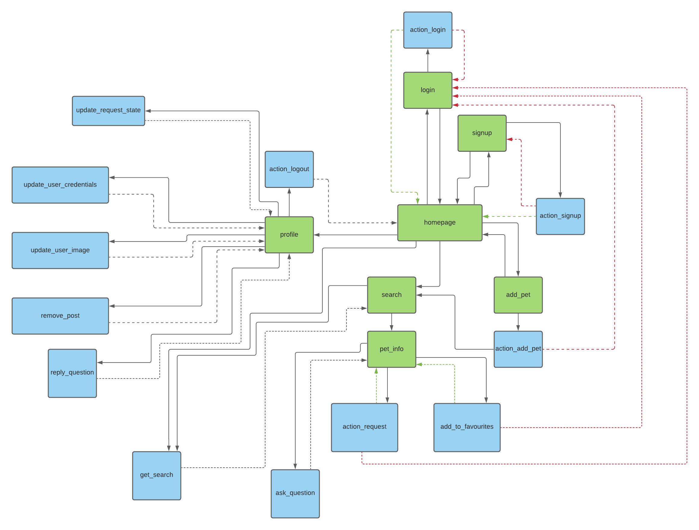
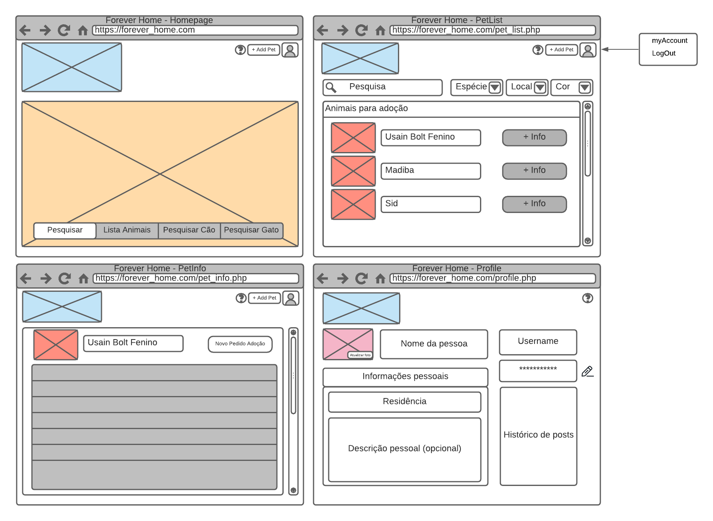
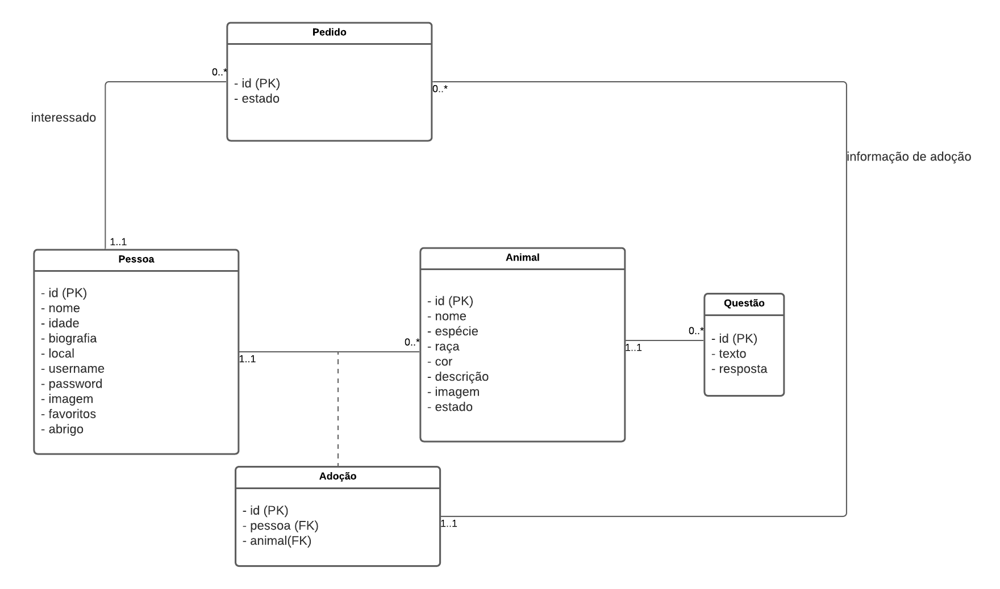

# feup-ltw
 
This programs were created during the **1st semester** of the **3rd year** of **Integrated Master in Informatics and Computing Engineering**, in **Web Languages and Technologies** curricular unity (FEUP).

[LTW FEUP-Sigarra](https://sigarra.up.pt/feup/en/UCURR_GERAL.FICHA_UC_VIEW?pv_ocorrencia_id=281471 "Curricular Unity Homepage")

## Contributors

All the work developed during this curricular unit was made side-by-side with

- [João Matos](https://github.com/MechJM "Github Profile").
- [José Maçães](https://github.com/zemmacaes "Github Profile").
- [Tomás Gonçalves](https://github.com/tomasfgon "Github Profile").

## Credentials
 To use the full functionalities of our website, you just have to signup.

## Libraries
 No library was used.

## Features
 - Security
     - XSS: yes
     - CSRF: yes
     - SQL using prepare/execute: yes
     - Passwords: bcrypt 
     - Data Validation: php
 - Technologies
     - Separated logic/database/presentation: yes
     - Semantic HTML tags: yes
     - Responsive CSS: yes
     - Javascript: yes
     - Ajax: yes
     - REST API: no 
  - Usability:
     - Error/success messages: yes, in some cases
     - Forms don't lose data on error: no

## Navigation Diagram

## UI Mockups

## Database

